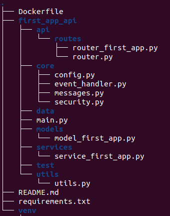

# Create FastAPI structure
This repository creates FastAPI basic structure for Machine Learning Models production

# Usage
First of all, the folder must be created in any where. Then, script should use as below
```
$ bash create_api_structure.sh -n <name_of_api> -p <created/folder/path>
```
While writing some data into README.md and .env files, warning can occur as below
```
create_api_structure.sh: line 12: /.env: Permission denied
create_api_structure.sh: line 19: /README.md: Permission denied
```
In this case, your README.md and .env files are not filled. Even if these are filled, please remember to fill inside. If you want to use default settings, you can run script with **sudo** as below without any warning
```
$ sudo bash create_api_structure.sh -n <name_of_api> -p <created/folder/path>
```
After all these steps, folder structure should look like as below


